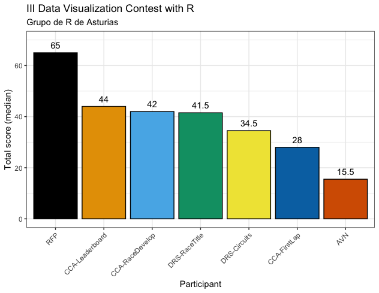

# Normas de puntuación

A la hora de evaluar los gráficos el jurado ha tenido en cuenta los aspectos mencionados en las bases del concurso de la siguiente forma:

1.	Estética: 20 puntos
2.	Utilidad: 30 puntos
3.	Código: 15 puntos
4.	[Gama de colores apropiada para acromatópsicos](https://www.color-blindness.com/coblis-color-blindness-simulator/): 5 puntos
5.	Elegancia del código: 1 punto extra en caso de empate

### Desarollo

- La remisión del código se puntuará favorablemente -> Valorado en el punto 3
- El manejo de datos es correcto -> Valorado en el punto 3
    - Si hay una transformación, deberá estar claramente enunciada y justificada
    - Si se excluyen valores extremos (outliers), se explicará cuándo y por qué
    - Si se excluye algún grupo de datos se explicará cuándo y por qué (por ejemplo, utilizar sólo adultos en vez de adultos y niños o utilizar países europeos en vez de todos los países)
- La técnica de visualización es correcta -> Valorado en los puntos 1 y 2
    - No hay ejes o escalas engañosas.
    - Los ejes estarán correctamente etiquetados y, de ser necesario, las unidades indicadas.
    - No se extraerán conclusiones sin un intervalo de confianza, valor p o R2.
    - Los gráficos de barras o de área no están truncados.
    - No hay problemas de resolución o de rango 
- En general, que la imagen:
    - Sea interpretable por acromatópsicos -> Valorado en el punto 4
    - No tenga decoraciones excesivas -> Valorado en el punto 1
    - Sea nítida y tenga una resolución adecuada -> Valorado en el punto 3
    - Si es interactiva, que sea web -> Valorado en el punto 2

---

# Resultado

Para establecer la clasificación se ha utilizado la mediana de la puntuación total para cada gráfico, obteniéndose el siguiente resultado:

